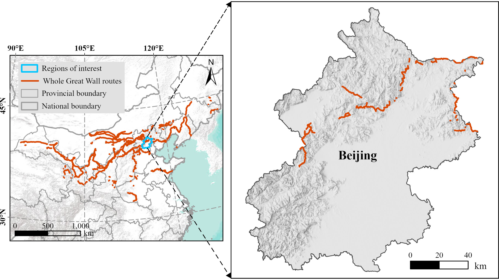

# TFCL-Net

This repository contains the official PyTorch implementation of the paper "**Terrain-aware Fusion and Connectivity-aware Learning Network for Great Wall Relic Extraction from Remote Sensing Imagery and Terrain Data**", submitted to the *IEEE Journal of Selected Topics in Applied Earth Observations and Remote Sensing (JSTARS)*.

## 📢 News

- **[2026-09-01]** The TFCL-Net repository is created.
- **[Coming Soon]** The dataset access will be released. The codes for our existing methods, including [SGGWSeg](https://github.com/2022jiangjiazheng/SGGWSeg) and [GWSegNet](https://github.com/labiao/GWSegNet), are also publicly available, with detailed methodology to be described in forthcoming publications.

## 📝 Abstract

Great Wall relic extraction from high resolution remote sensing (RS) imagery is important for cultural heritage discovery, mapping, and monitoring. However, this task remains challenging because mountainous relics often appear as narrow linear structures with weak visual contrast and are easily affected by vegetation cover, terrain shadows, and complex backgrounds.

To address these challenges, this paper proposes TFCL-Net for mountainous Great Wall relic extraction using optical RS imagery and terrain priors. Specifically, the terrain-aware fusion (TAF) module integrates DEM and ridge information at different network depths, allowing the model to better exploit terrain priors for relic localization and representation. The connectivity-aware learning (CAL) module improves the continuity of narrow wall predictions and reduces local discontinuities. In addition, a structure-conditioned image synthesis (SCIS) strategy generates synthetic images with clearer relic traces, and an adaptive filtering step removes unreliable samples. To support model training and evaluation, we construct a multisource Beijing Great Wall relic dataset that includes high resolution optical RS imagery, DEM data, ridge prior maps, and polygon-level ground truth annotations. A three-level evaluation system, including pixel-level, centerline-level, and relaxed-level metrics, is adopted to assess both segmentation accuracy and structural quality.

## ✨ Contributions

1. A comprehensive framework is proposed for Great Wall relic extraction from optical RS imagery and terrain data. By combining DEM and ridge priors, the proposed framework provides an effective solution for the discovery of weak and linear Great Wall relics in mountainous areas.

2. TFCL-Net is proposed by integrating TAF and CAL into a basic semantic segmentation architecture. TAF adaptively incorporates terrain guidance at different network depths to enhance geometric consistency, while CAL introduces auxiliary structural supervision to reduce fragmented predictions and improve the continuity of extracted linear relic traces.

3. A SCIS strategy is developed to augment the training data under structural constraints. It uses Great Wall ground truth (GT) maps and text prompts to generate RS images with clearer relic traces, and applies adaptive filtering to remove unreliable samples with inconsistent GT correspondence.

## 🚀 Framework

<p align="center">
  
</p>
<p align="center">
  <em>Overall framework of the proposed TFCL-Net.</em>
</p>

## 📂 Dataset

The study area is located in Beijing, northern China, where Great Wall relics are widely distributed across mountainous areas of the municipality. The publicly available Great Wall survey routes were obtained from  [The Great Wall Heritage of China](https://www.greatwallheritage.cn/CCMCMS/). A 50 m buffer along the survey routes was used for imagery collection and sample construction.

<p align="center">
  
</p>
<p align="center">
  <em>Spatial distribution of the Great Wall routes and the study area in Beijing.</em>
</p>


The optical imagery was obtained from Google Earth, and the DEM data were acquired from the ALOS PALSAR DEM dataset. The two data sources were spatially aligned and jointly processed into 512 × 512 remote-sensing image patches. The dataset and corresponding download instructions will be released separately.

The current loader expects the following structure:

```text
<DATA_ROOT>/
├── train.txt
├── val.txt
├── images/
│   └── <sample>.png
├── labels/
│   └── <sample>_mask.png
├── connect_8_d1/
│   ├── <sample>_mask_0.png
│   ├── <sample>_mask_1.png
│   └── <sample>_mask_2.png
├── connect_8_d3/
│   ├── <sample>_mask_0.png
│   ├── <sample>_mask_1.png
│   └── <sample>_mask_2.png         # Required: For CAL learning
├── dem/                            # Required: <sample>.tif
└── ridge_tif_kernel_filtered_10m/  # Required: <sample>_kde.png
```

Each line in `train.txt` and `val.txt` contains an image filename including its extension. Binary masks are stored as `0/255` and converted internally to class IDs `0/1`. Three RGB masks provide nine directional connectivity channels for each neighborhood range.

Set `data_root` in the `GreatWallDataset` instances in `config/greatwall/dualformer.py` before training.

The connectivity labels for CAL are generated based on the connectivity label construction scheme in [CoANet](https://github.com/mj129/CoANet), with adaptations for our task.

## 🛠️ Usage

### 1. Dependencies

The code is based on Python, PyTorch, and PyTorch Lightning. Install a PyTorch build compatible with your CUDA version, followed by the repository requirements:

```bash
conda create -n tfclnet python=3.8 -y
conda activate tfclnet

pip install torch torchvision --index-url https://download.pytorch.org/whl/cu118
pip install -r requirements.txt
```

### 2. Pretrained Weights

The main model uses an ADE20K-pretrained Swin Transformer Base checkpoint to initialize its encoder. Place the checkpoint at:

```text
pretrain_weights/stseg_base.pth
```

### 3. Training

```bash
python train_supervision.py -c config/greatwall/dualformer.py
```

### 4. Evaluation

```bash
python greatwall_test.py \
  -c config/greatwall/dualformer.py \
  --ckpt_path model_weights/greatwall/dualformer-512-greatwall-e80/last.ckpt \
  -o results/tfcl_net \
  --rgb
```

Use `-t lr` or `-t d4` to enable test-time augmentation. The script saves predicted masks and reports per-class F1 and IoU, mean F1, mean IoU, and overall accuracy.

## ✒️ Citation

If you find this work useful, please consider citing the TFCL-Net paper. The BibTeX entry will be added after publication.

## 🤝 Acknowledgements

This project is developed from the [GeoSeg](https://github.com/WangLibo1995/GeoSeg) and [CoANet](https://github.com/mj129/CoANet) codebase. We thank the corresponding authors and the developers of PyTorch, PyTorch Lightning, timm, Albumentations, and ttach for their open-source contributions.

## 📄 License

This project is distributed under the terms provided in [LICENSE](LICENSE).
